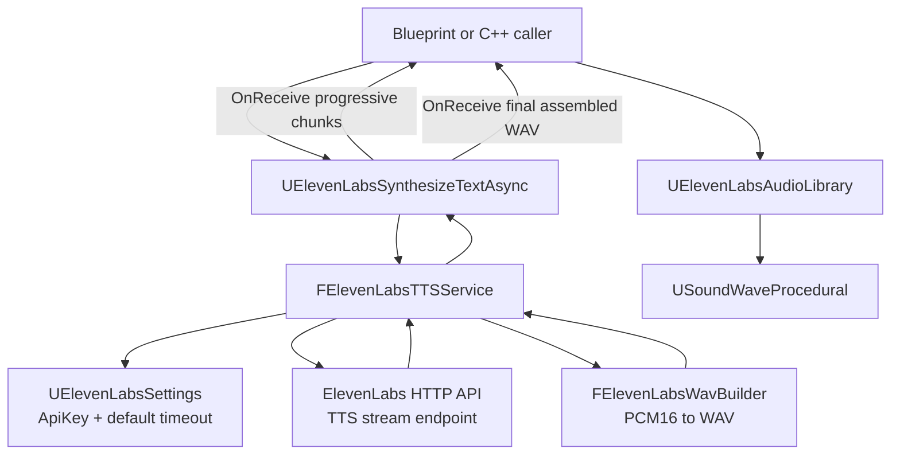
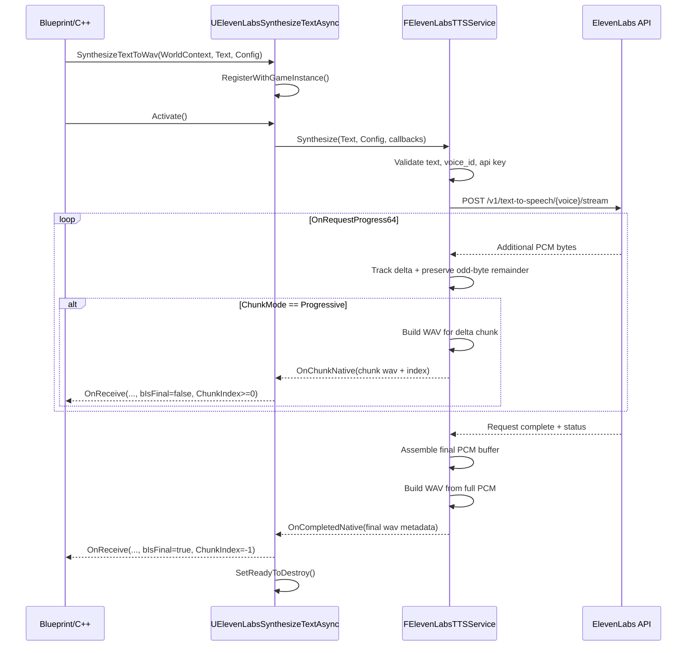
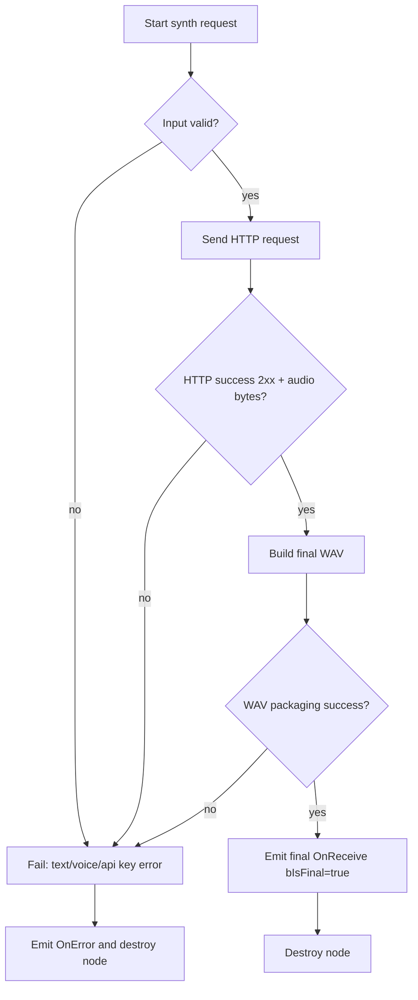
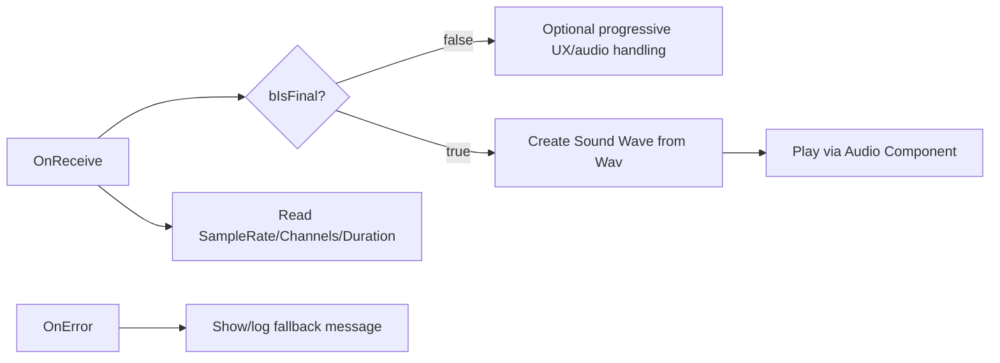

# Eleven Labs Unreal Engine Plugin

Production-oriented Unreal Engine runtime plugin for ElevenLabs Text-to-Speech (TTS) streaming, with Blueprint-first async APIs, PCM-to-WAV packaging, and runtime audio helpers.

This document is a deep technical reference for the current implementation in this repository.

## Table of Contents

- [Plugin Scope](#plugin-scope)
- [Project Layout](#project-layout)
- [Architecture Overview](#architecture-overview)
- [Runtime Request Lifecycle](#runtime-request-lifecycle)
- [Configuration](#configuration)
- [Public API Reference](#public-api-reference)
- [Blueprint Integration Guide](#blueprint-integration-guide)
- [C++ Integration Guide](#c-integration-guide)
- [Error Model and Validation](#error-model-and-validation)
- [Audio Pipeline Details](#audio-pipeline-details)
- [Logging and Observability](#logging-and-observability)
- [Extensibility Notes](#extensibility-notes)
- [Troubleshooting](#troubleshooting)
- [External References](#external-references)

## Plugin Scope

Implemented today:

- Runtime module: `ElevenLabs` (`Type = Runtime`, `LoadingPhase = Default`)
- Project settings via `UDeveloperSettings`
- Async TTS entry point (`UElevenLabsSynthesizeTextAsync`) for Blueprint/C++
- Streaming HTTP integration against ElevenLabs `/v1/text-to-speech/{voice_id}/stream`
- Progressive chunk callbacks (optional behavior)
- Final assembled WAV callback (always produced on success)
- WAV utility helpers:
  - PCM16 -> WAV builder
  - WAV -> `USoundWaveProcedural`
  - Optional temp file save helper

Not implemented yet (but architecture allows extension):

- STT, voices listing/management, dubbing, history, etc.
- Authentication sources beyond plugin settings (`ApiKey`)
- Native cancellation API for in-flight requests
- Multi-channel output support (current flow is mono)

## Project Layout

Core source tree:

- `ElevenLabs/ElevenLabs.uplugin`
- `ElevenLabs/Source/ElevenLabs/ElevenLabs.Build.cs`
- `ElevenLabs/Source/ElevenLabs/Public/`
  - `ElevenLabsModule.h`
  - `ElevenLabsLog.h`
  - `ElevenLabsSettings.h`
  - `ElevenLabsTTSTypes.h`
  - `ElevenLabsSynthesizeTextAsync.h`
  - `ElevenLabsAudioLibrary.h`
- `ElevenLabs/Source/ElevenLabs/Private/`
  - `ElevenLabsModule.cpp`
  - `ElevenLabsLog.cpp`
  - `ElevenLabsSettings.cpp`
  - `ElevenLabsSynthesizeTextAsync.cpp`
  - `ElevenLabsTTSService.h/.cpp`
  - `ElevenLabsWavBuilder.h/.cpp`
  - `ElevenLabsAudioLibrary.cpp`

Build dependencies declared by `ElevenLabs.Build.cs`:

- Public: `Core`, `CoreUObject`, `Engine`, `HTTP`, `Json`, `JsonUtilities`, `DeveloperSettings`
- Private: `Projects`

## Architecture Overview



Layer responsibilities:

- `UElevenLabsSynthesizeTextAsync`
  - Owns async action lifecycle for Blueprint.
  - Bridges native service callbacks into dynamic multicast delegates.
  - Emits both progressive events and terminal result.
- `FElevenLabsTTSService`
  - Validates request/config.
  - Builds endpoint URL and JSON payload.
  - Streams/accumulates PCM bytes from HTTP response.
  - Produces per-chunk WAV (progressive mode) and final full WAV.
- `FElevenLabsWavBuilder`
  - Deterministically writes RIFF/WAVE header + PCM payload.
- `UElevenLabsAudioLibrary`
  - Converts WAV bytes into runtime `USoundWaveProcedural`.
  - Saves WAV bytes to `Saved/ElevenLabs/*.wav`.

## Runtime Request Lifecycle



Error path:



## Configuration

Project Settings location:

- `Edit -> Project Settings -> Plugins -> Eleven Labs`

Backed by class:

- `UElevenLabsSettings` (`Config = Game`, `DefaultConfig`)

Fields:

- `ApiKey` (`FString`)
- `DefaultTimeoutSeconds` (`float`, default `30.0`)

INI example (`Config/DefaultGame.ini`):

```ini
[/Script/ElevenLabs.ElevenLabsSettings]
ApiKey=YOUR_ELEVENLABS_API_KEY
DefaultTimeoutSeconds=30.000000
```

Timeout resolution behavior:

- If `FElevenLabsTTSConfig.RequestTimeoutSeconds > 0`, request uses that value.
- Otherwise, request uses `UElevenLabsSettings::DefaultTimeoutSeconds`.

## Public API Reference

### `FElevenLabsTTSConfig`

Primary request config struct (`BlueprintType`):

- `VoiceId` (`FString`) - required
- `ModelId` (`FString`) - default `eleven_multilingual_v2`
- `LanguageCode` (`FString`) - optional
- `Stability` (`float`) - default `0.5`
- `SimilarityBoost` (`float`) - default `0.75`
- `Style` (`float`) - default `0.35`
- `bUseSpeakerBoost` (`bool`) - default `true`
- `Speed` (`float`) - default `1.0`
- `SampleRate` (`int32`) - default `16000` (clamped at runtime to min `8000`)
- `LatencyOptimizationLevel` (`int32`) - default `4`, clamped `0..4`
- `ChunkMode` (`EElevenLabsChunkMode`)
  - `Progressive`
  - `AssembleThenReturn`
- `RequestTimeoutSeconds` (`float`) - default `30.0`
- `PreviousText` (`FString`) - optional
- `NextText` (`FString`) - optional
- `Seed` (`int32`) - default `-1`; only sent if `>= 0`
- `bEnableLogging` (`bool`) - toggles ElevenLabs endpoint `enable_logging`

### `UElevenLabsSynthesizeTextAsync`

Factory:

- `SynthesizeTextToWav(UObject* WorldContextObject, const FString& Text, FElevenLabsTTSConfig Config)`

Delegates:

- `OnReceive(const TArray<uint8>& WavBytes, bool bIsFinal, int32 ChunkIndex, int32 SampleRate, int32 NumChannels, float DurationSeconds)`
- `OnError(const FString& ErrorMessage)`

Event semantics:

- Progressive event:
  - only when `ChunkMode == Progressive`
  - `bIsFinal = false`
  - `ChunkIndex = 0..N`
  - payload is WAV built from the latest streamed PCM delta
  - duration currently reported as `0.0f` for chunk callbacks
- Final event:
  - emitted once on success (for both chunk modes)
  - `bIsFinal = true`
  - `ChunkIndex = -1`
  - payload is full assembled WAV for the entire utterance

### `UElevenLabsAudioLibrary`

- `CreateSoundWaveFromWav(const TArray<uint8>& WavBytes) -> USoundWave*`
  - Validates WAV header via `FWaveModInfo`
  - Requires 16-bit PCM WAV
  - Creates and populates `USoundWaveProcedural`
- `SaveWavBytesToTempFile(const TArray<uint8>& WavBytes, const FString& FilePrefix = "elevenlabs_tts") -> FString`
  - Writes to `ProjectSavedDir()/ElevenLabs/<prefix>_<guid>.wav`
  - Returns empty string on failure

### Result/Chunk structs

- `FElevenLabsAudioChunk`
  - `Data` (`TArray<uint8>`) - WAV bytes for chunk
  - `ChunkIndex` (`int32`)
- `FElevenLabsTTSResult`
  - `WavBytes` (`TArray<uint8>`)
  - `SampleRate` (`int32`)
  - `NumChannels` (`int32`)
  - `DurationSeconds` (`float`)

## Blueprint Integration Guide

Recommended baseline flow:

1. Create `Make Eleven Labs TTSConfig`
2. Set at minimum:
   - `VoiceId`
   - desired model and voice settings
3. Call `ElevenLabs Synthesize Text To Wav`
4. Handle:
   - `OnReceive` with `bIsFinal == true` -> `Create Sound Wave from Wav` -> play
   - `OnError` -> UI/log fallback

Low-latency handling option:

- If `ChunkMode = Progressive`, you can consume non-final chunk WAV payloads as they arrive.
- For simple/robust one-shot playback, use only final payload (`bIsFinal == true`).

Blueprint event handling pattern:



## C++ Integration Guide

Add module dependency:

```csharp
PublicDependencyModuleNames.AddRange(new[]
{
    "Core",
    "CoreUObject",
    "Engine",
    "ElevenLabs"
});
```

Usage skeleton:

```cpp
#include "ElevenLabsSynthesizeTextAsync.h"
#include "ElevenLabsAudioLibrary.h"
#include "ElevenLabsTTSTypes.h"

void UMyVoiceComponent::RequestSpeech(const FString& Text)
{
    FElevenLabsTTSConfig Config;
    Config.VoiceId = TEXT("your_voice_id");
    Config.ModelId = TEXT("eleven_multilingual_v2");
    Config.SampleRate = 16000;
    Config.ChunkMode = EElevenLabsChunkMode::AssembleThenReturn;

    UElevenLabsSynthesizeTextAsync* Node =
        UElevenLabsSynthesizeTextAsync::SynthesizeTextToWav(this, Text, Config);

    Node->OnReceive.AddDynamic(this, &UMyVoiceComponent::HandleTtsReceive);
    Node->OnError.AddDynamic(this, &UMyVoiceComponent::HandleTtsError);
}
```

## Error Model and Validation

Validation currently performed before/around HTTP:

- Empty text -> `"Text cannot be empty."`
- Empty `VoiceId` -> `"VoiceId is required."`
- Missing API key -> instructs user to Project Settings location
- Failed request startup -> `"Failed to start ElevenLabs HTTP request."`
- Transport failure/timeout -> `"ElevenLabs request failed or timed out."`
- Non-2xx response -> includes status code + first body segment
- Empty audio data -> `"ElevenLabs returned empty audio data."`
- WAV build failure -> `"Failed to package ElevenLabs PCM data into WAV."`

Model-specific behavior:

- `optimize_streaming_latency` query param is omitted for `model_id == eleven_v3`
- Reason: current implementation treats that model as incompatible with this query arg

## Audio Pipeline Details

PCM/WAV handling specifics:

- Endpoint requests `output_format=pcm_<SampleRate>`
- Internal stream handling preserves PCM frame integrity:
  - If an odd number of bytes arrives, one remainder byte is buffered
  - Buffered byte is prepended to next delta
- Progressive chunks are WAV-wrapped independently
- Final assembled PCM is WAV-wrapped once at completion
- Output channel count in current service path is fixed to mono (`1`)

WAV construction (`FElevenLabsWavBuilder`):

- RIFF header (`RIFF`, `WAVE`, `fmt `, `data`)
- PCM format code `1`
- Bit depth `16`
- ByteRate = `SampleRate * NumChannels * sizeof(int16)`
- BlockAlign = `NumChannels * sizeof(int16)`

Runtime sound creation (`CreateSoundWaveFromWav`):

- Validates header via `FWaveModInfo::ReadWaveInfo`
- Rejects non-16-bit PCM WAV
- Uses `USoundWaveProcedural`, queues PCM bytes, sets:
  - sample rate
  - channel count
  - byte size
  - duration estimate
  - `SOUNDGROUP_Voice`

## Logging and Observability

Log category:

- `LogElevenLabs`

Typical emitted events:

- Module startup/shutdown
- Async node create/activate/destroy
- HTTP stream start and completion code
- Chunk-level receipt (`VeryVerbose`)
- Final WAV packaging metadata
- All fail paths (`Error`)

Recommended runtime log verbosity while integrating:

- `LogElevenLabs Verbose` for request + audio diagnostics
- `LogElevenLabs VeryVerbose` only when debugging progressive chunk behavior

## Extensibility Notes

Current code is cleanly split for future features:

- Add new API surface in separate service classes parallel to `FElevenLabsTTSService`
- Reuse `UElevenLabsSettings` for auth/timeouts and extend with endpoint-level defaults
- Keep Blueprint API stable by adding additional async nodes per capability
- Consider adding:
  - cancellation support (store handle, abort `ActiveRequest`)
  - richer metadata callbacks from response headers
  - configurable output format/channel count
  - key resolution fallback (env var or command line) for CI/dev workflows

## Troubleshooting

- `OnError: ElevenLabs API key is missing`
  - Set `Project Settings -> Plugins -> Eleven Labs -> API Key`
  - Ensure `DefaultGame.ini` includes the setting in the correct section
- `OnError: VoiceId is required`
  - Set `FElevenLabsTTSConfig.VoiceId`
- HTTP non-2xx errors
  - Verify API key validity and voice/model compatibility in ElevenLabs docs
  - Inspect returned message snippet in plugin error text
- No sound from returned bytes
  - Use final payload (`bIsFinal == true`) first
  - Confirm your playback path uses a valid audio component and world context
- `CreateSoundWaveFromWav` returns `nullptr`
  - Ensure payload is valid 16-bit PCM WAV (the plugin final callback already is)
  - Avoid passing arbitrary raw PCM bytes directly to this helper

## External References

ElevenLabs official docs:

- API introduction: [https://elevenlabs.io/docs/api-reference/introduction](https://elevenlabs.io/docs/api-reference/introduction)
- TTS stream endpoint: [https://elevenlabs.io/docs/api-reference/text-to-speech/stream](https://elevenlabs.io/docs/api-reference/text-to-speech/stream)
- Eleven API quickstart: [https://elevenlabs.io/docs/eleven-api/quickstart](https://elevenlabs.io/docs/eleven-api/quickstart)
- API pricing: [https://elevenlabs.io/pricing/api](https://elevenlabs.io/pricing/api)

Unreal references:

- `UDeveloperSettings`: [https://dev.epicgames.com/documentation/en-us/unreal-engine/API/Runtime/DeveloperSettings/UDeveloperSettings](https://dev.epicgames.com/documentation/en-us/unreal-engine/API/Runtime/DeveloperSettings/UDeveloperSettings)
- `UBlueprintAsyncActionBase`: [https://dev.epicgames.com/documentation/en-us/unreal-engine/API/Runtime/Engine/Kismet/UBlueprintAsyncActionBase](https://dev.epicgames.com/documentation/en-us/unreal-engine/API/Runtime/Engine/Kismet/UBlueprintAsyncActionBase)
- `USoundWaveProcedural`: [https://dev.epicgames.com/documentation/en-us/unreal-engine/API/Runtime/Engine/Sound/USoundWaveProcedural](https://dev.epicgames.com/documentation/en-us/unreal-engine/API/Runtime/Engine/Sound/USoundWaveProcedural)

---

If you want, the next step can be an additional section documenting exact Blueprint graph screenshots/patterns (single-shot playback vs progressive playback), or a contributor section with coding conventions for adding new ElevenLabs endpoints in this plugin.

